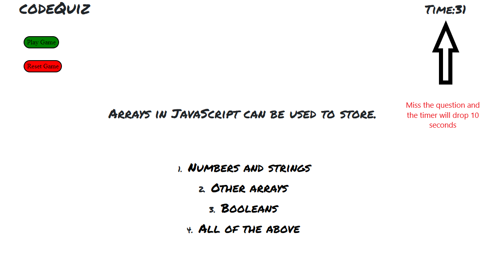

# codeQuiz

As a coding bootcamp student

I wanted to take a timed quiz on Javascript fundamentals that stores high scores

So that I can guage my progress compared to my peers

## How It Works

This codeQuiz module will ask you 5 questions that will put your JavaScript, Developer Tools, and basic coding skills to the test. With every question that is missed, the timer drops 10 seconds, increasing the pressure on the player. When the timer runs out the game is over and the score that you ended with will display on the screen. A "Save initals" and "Input Field" will display. Save your initials to the high score, reset and play again!

## Installation 

Use the systems terminal to enter the command "git clone" followed by the applications URL link (ex: https://github.com/Castoreno05/codeQuiz.git).

## Demo

Demo to the codeQuiz module https://castoreno05.github.io/codeQuiz/

## Contributors

Matthew Castoreno <matthew.castoreno@yahoo.com>

## License & Copyright

Copyright (c) 2022 Castoreno05

