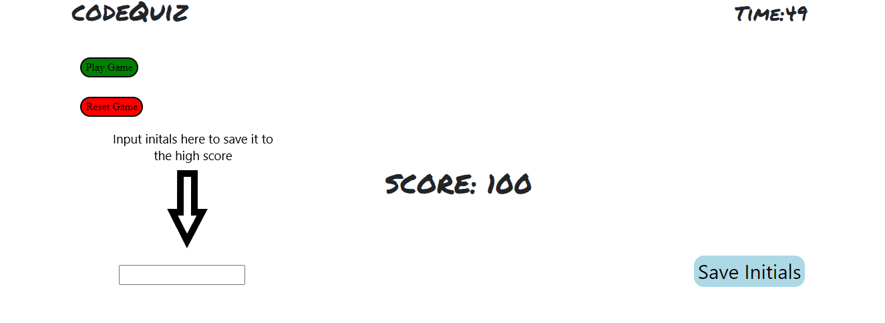

# Code-Quiz

Press play! This module will ask you 5 questions that will put your JavaScript, Developer Tools, and basic coding skills to the test.

Each question is worth 20 points, so try to not miss! With every question that is missed, the timer drops 10 secs increasing the pressure on the player.

When the timer runs out the game is over and the score that you ended with will display on the screen. A "Save initals" and "Input Field" will display.

Save your initials to the high score, reset and play again!

---

# How It Works

